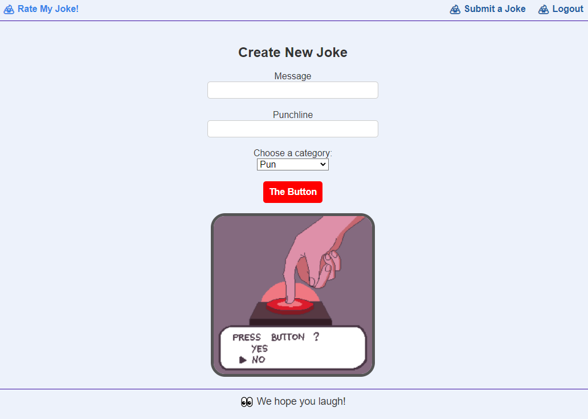

# Rate My Joke!

## Description
* This application is a website that allows for users to create an account, login, and submit jokes. While submitting a joke, the user keys the joke, along with the punchline and selects a category for the joke. The categories for the joke are puns, dad jokes, limericks, and knock knocks. After submitting a joke on the website, fellow users can upvote jokes that they like. 

## Table of Contents
* [Installation](#installation)

* [Usage](#usage)

* [Contributors](#contributors)

* [License](#license)

* [Badges](#badges)

## Installation
* To install this application, you must clone the repo and install the dependencies using npm install. From here, you can initialize the server using npm start. 

## Usage
* The application can be opened and used here directly: https://jokeappproject2.herokuapp.com/

## Contributors
* Jay Beach
* Angel Rios
* University of Arizona

## License
* This application is covered under GPL v2.

## Badges

* 
* 
* 
* 